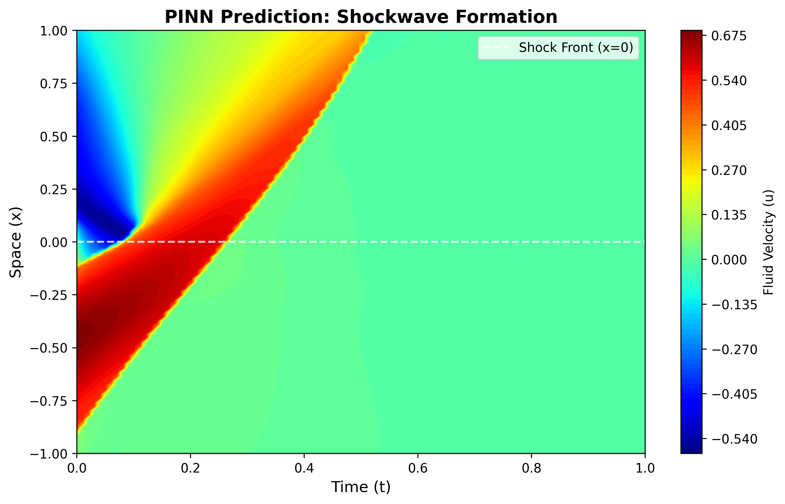
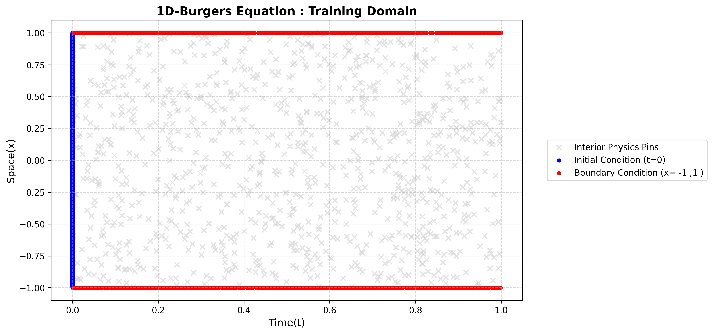

# Physics-Informed Neural Network (PINN) for 1D Burgers' Equation

**Author:** M. Sairam

## Abstract

This repository contains a PyTorch implementation of a Physics-Informed Neural Network (PINN) designed to solve the 1D viscous Burgers' equation. The model leverages continuous-time auto-differentiation to strictly enforce physical conservation laws (Navier-Stokes momentum) during the neural network's training phase, without relying on labeled interior domain data.

## Mathematical Formulation

The network approximates the latent solution $u(x,t)$ to the Burgers' equation:

$$
u_t + u u_x - \nu u_{xx} = 0
$$

With the following physical constraints:

* **Spatio-Temporal Domain:** $x \in [-1, 1], \quad t \in [0, 1]$
* **Initial Condition (IC):** $u(x, 0) = -\sin(\pi x)$
* **Boundary Conditions (BC):** $u(-1, t) = u(1, t) = 0$
* **Kinematic Viscosity ($\nu$):** $0.01 / \pi$

## Architecture & Methodology

* **Network Topology:** A fully-connected Multi-Layer Perceptron (MLP) with a `[2, 32, 32, 32, 1]` architecture.
* **Activation Function:** `Tanh` is strictly utilized across all hidden layers to ensure infinite continuous differentiability. This prevents the $NaN$ gradient pathology associated with 2nd-order derivatives ($u_{xx}$) when using standard `ReLU` activations.
* **Collocation Strategy:** 10,000 random spatio-temporal points sampled uniformly across the interior domain to evaluate the PDE residual.

## Optimization & Engineering Trade-offs

### 1. First-Order Optimization (Adam vs. L-BFGS)

While standard scientific ML literature often recommends a hybrid optimizer (`Adam` followed by `L-BFGS`), this implementation deliberately utilizes **pure First-Order Adam** across an extended 10,000 epoch horizon. This decision was made to stabilize the stiff gradient of the shock-front entirely through convective transport, avoiding the heavy memory allocation and matrix-inversion overhead required to compute the Hessian in Quasi-Newton methods.

### 2. Homoscedastic Task Uncertainty Weighting

A standard summation of loss terms ($L_{Total} = L_{IC} + L_{BC} + L_{PDE}$) often fails due to gradient pathologies where the stiff PDE residual dominates the boundary constraints. To circumvent this, the model employs dynamic loss balancing via learnable uncertainty parameters:

$$
L_{total} = (L_{ic} \cdot e^{-w_{ic}} + w_{ic}) + (L_{bc} \cdot e^{-w_{bc}} + w_{bc}) + (L_{pde} \cdot e^{-w_{pde}} + w_{pde})
$$

By modeling the loss terms with learnable log-variance parameters ($w$), the network dynamically self-regulates the priority of the boundaries versus the physical interior during training, preventing trivial weight collapse.

## Results

The network successfully captures the steep shock-front formation at $x=0$ as $t \rightarrow 1.0$.

### Spatio-Temporal Shockwave (Model Prediction)



### Training Domain & Collocation Points



## Repository Structure

```text
burgers-pinn-solver/
│
├── README.md                       
├── src/                            
│   └── train.py                        # Full architecture, dynamic weighting, and Adam loop
├── models/                         
│   └── burgers_pinn_weights.pth        # Saved state_dict of the trained brain
└── assets/                         
    ├── pinn_collocation_points.png
    └── pinn_shockwave_heatmap.png
```
